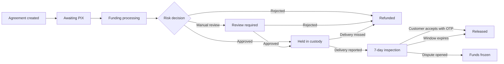
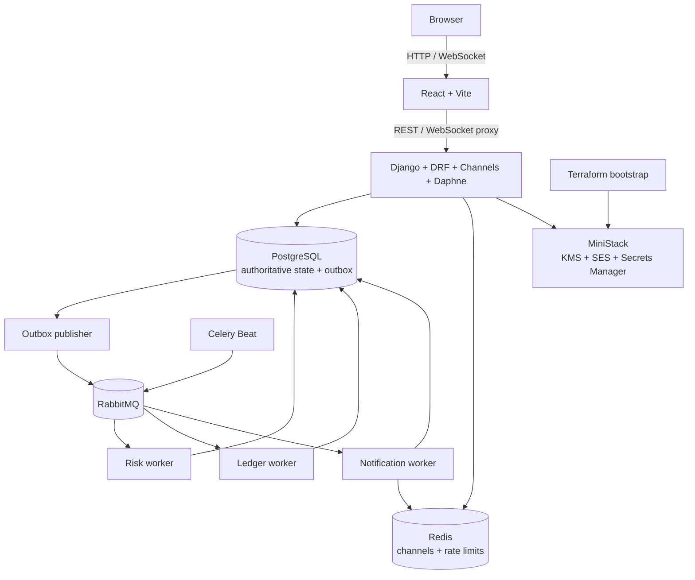

# Escrow

Escrow is a portfolio-only B2B2C custody simulation for marketplaces and online stores. An
organization creates an agreement, its customer pays through a simulated PIX checkout, and the
funds move through risk analysis, custody, delivery, inspection, release, or refund.

> [!WARNING]
> This repository is **not production financial software**. It does not process real money and
> must not receive real customer data. It makes no legal-custody, KYC/AML, PCI, regulatory,
> security-compliance, or privacy-compliance claim.

The project emphasizes financial invariants, idempotent asynchronous processing, tenant isolation,
auditability, and reproducible local infrastructure.

## Implemented capabilities

- Organization registration, session authentication, password recovery, role-based membership,
  and tenant-scoped access.
- Strong-password validation and a privacy-preserving HIBP password check, mocked in local
  development.
- Scoped API keys with one-time secret display, rotation overlap, revocation, and rate limiting.
- Configurable signed webhooks with delivery history, retries, replay, and outgoing rate limiting.
- Idempotent escrow-agreement creation for BRL or USD, opaque checkout capabilities, encrypted
  customer PII, blind indexes, and masked public responses.
- Accountless hosted checkout and simulated PIX charges with signed, duplicate-safe callbacks.
- Versioned, deterministic funding-risk decisions: approval, manual review, or rejection.
- Append-only, double-entry postings for received, held, released, rejected, and refunded funds.
- Delivery reporting, a seven-day inspection window, OTP-authorized customer acceptance,
  deadline-based refunds, and inspection-expiry releases.
- Transactional outbox, explicit RabbitMQ topology, idempotent consumers, dead-letter storage and
  replay, status webhooks, and sequenced WebSocket updates.
- Correlation IDs, structured JSON logs, health probes, and immutable audit events.
- React UI in pt-BR for access, organization operations, integrations, and public checkout.

Dispute state transitions, SLA modeling, and evidence validation exist at the domain/service layer.
Public dispute/evidence endpoints and Ceph-backed private object storage are not wired into the
current Compose stack yet.

## Custody lifecycle



The main asynchronous funding path is:

1. Organization creates an agreement using an API key and idempotency key.
2. Customer opens the opaque checkout URL and creates a simulated PIX charge.
3. A signed provider callback atomically records the payment, posts it to pending risk, and writes
   an outbox command.
4. The outbox publisher sends the command to RabbitMQ. The risk worker evaluates a persisted,
   versioned policy snapshot.
5. Approved funding reaches the ledger worker and becomes held custody. Rejected funding returns
   through PIX clearing; borderline funding waits for a human decision.
6. State changes produce durable webhook work and sequenced realtime updates.

## Architecture

The backend is a Django modular monolith. Domain modules share one PostgreSQL database while
keeping models, services, tasks, and transport boundaries explicit.



### Main technologies

| Area | Stack |
| --- | --- |
| API and domain | Python 3.13, Django 5.2, Django REST Framework 3.16 |
| Realtime | Django Channels, Daphne, Redis |
| Async processing | Celery, RabbitMQ, transactional outbox |
| Data | PostgreSQL 16; Redis for non-authoritative state |
| Local AWS APIs | MiniStack: KMS, SES, Secrets Manager |
| Infrastructure | Docker Compose, Terraform 1.12 |
| Frontend | React 19, TypeScript, Vite, Bun |
| Quality | Ruff, mypy, pytest, Biome, Bun Test, Playwright |

## Ledger example

All amounts are integers in minor units, postings stay inside one currency, total debits must equal
total credits, and posted records cannot be updated or deleted. For a BRL 100.00 agreement with a
2.5% fee:

| Event | Debit | Credit |
| --- | --- | --- |
| PIX confirmed | `PIX_CLEARING` 10,000 | `FUNDS_PENDING_RISK` 10,000 |
| Risk approved | `FUNDS_PENDING_RISK` 10,000 | `ESCROW_LIABILITY` 10,000 |
| Funds released | `ESCROW_LIABILITY` 10,000 | `ORGANIZATION_PAYABLE` 9,750 + `PLATFORM_FEE_REVENUE` 250 |

Unique financial intents, idempotency keys, posting hashes, database constraints, and PostgreSQL
immutability triggers prevent duplicate or historical mutation effects.

## Run locally with Docker Compose

### Requirements

- Docker Engine with Docker Compose v2.
- Ports `5173`, `8000`, `4566`, and `15672` available.
- Enough Docker resources for PostgreSQL, RabbitMQ, Redis, MiniStack, Terraform, the API, five
  Celery processes, and the frontend. No measured minimum or Compose resource limit is defined yet.

Host Python, Bun, and Terraform are not required for the full Compose path.

```bash
docker compose up --build --wait --wait-timeout 120
```

The API container applies Django migrations before starting Daphne. The Terraform service also
initializes MiniStack resources before the API becomes healthy.

| Service | URL |
| --- | --- |
| Frontend | <http://localhost:5173> |
| API liveness | <http://localhost:8000/health/live/> |
| API readiness | <http://localhost:8000/health/ready/> |
| OpenAPI JSON | <http://localhost:8000/api/v1/openapi.json> |
| RabbitMQ management | <http://localhost:15672> (`escrow` / `escrow-local-only`) |
| MiniStack | <http://localhost:4566> |

Follow core application logs:

```bash
docker compose logs -f api outbox-publisher risk-worker ledger-worker notifications-worker
```

Stop containers while preserving named data volumes:

```bash
docker compose down
```

## Development setup

The lockfiles are authoritative. Backend commands run from the repository root; frontend commands
run from `frontend/`.

Terraform validation outside Docker additionally requires Terraform 1.12.x. The full Compose path
uses the pinned Terraform container instead.

### Backend

Requirements: `uv` 0.9.x and Python 3.13.

```bash
uv python install 3.13
uv sync --locked --group dev
```

### Frontend

Requirement: Bun 1.3.x. Node package-manager commands are intentionally not used.

```bash
cd frontend
bun install --frozen-lockfile
```

Install Playwright's browser once before running end-to-end tests:

```bash
cd frontend
bunx playwright install chromium
```

## Lint, format, type-check, and test

These commands match the GitHub Actions workflow.

### Backend validation

```bash
uv run ruff check .
uv run ruff format --check .
uv run mypy src
uv run pytest -q
```

Apply backend lint fixes and formatting:

```bash
uv run ruff check --fix .
uv run ruff format .
```

### Frontend validation

```bash
cd frontend
bun run lint
bun run typecheck
bun test
bun run test:e2e
bun run build
```

`bun run lint` executes `biome check .`, validating both lint rules and formatting. Apply safe Biome
fixes and formatting with:

```bash
cd frontend
bunx biome check --write .
```

Playwright starts an isolated Vite server on port `4173` unless `PLAYWRIGHT_BASE_URL` is set.

### Terraform validation

```bash
terraform -chdir=terraform fmt -check -recursive
terraform -chdir=terraform init -backend=false -input=false
terraform -chdir=terraform validate
```

Apply Terraform formatting with:

```bash
terraform -chdir=terraform fmt -recursive
```

### Compose smoke test

```bash
docker compose up --build --wait --wait-timeout 120
curl --fail --show-error http://localhost:8000/health/live/
curl --fail --show-error http://localhost:8000/health/ready/
curl --fail --show-error http://localhost:5173/
```

## API contract

The versioned integration API lives under `/api/v1/`. The generated schema is available at
`/api/v1/openapi.json` when the API is running.

After changing the backend contract, regenerate the checked-in OpenAPI artifact and TypeScript
types:

```bash
cd frontend
bun run api:generate
```

Commit both `frontend/src/lib/generated/openapi.json` and
`frontend/src/lib/generated/openapi.ts` with the contract change.

## Configuration

Compose contains fictional local-only credentials and sets `DJANGO_DEBUG=true`. Important setting
groups are:

| Purpose | Variables |
| --- | --- |
| Core services | `DATABASE_URL`, `RABBITMQ_URL`, `REDIS_URL` |
| Django | `DJANGO_SECRET_KEY`, `DJANGO_DEBUG`, `DJANGO_ALLOWED_HOSTS` |
| PII protection | `PII_ENCRYPTION_BACKEND`, `PII_KMS_KEY_ID`, `PII_BLIND_INDEX_SECRET` |
| API capabilities | `API_KEY_HMAC_SECRET`, `CHECKOUT_TOKEN_HMAC_SECRET`, `AGREEMENT_IDEMPOTENCY_HMAC_SECRET` |
| Local email and AWS APIs | `EMAIL_DELIVERY_BACKEND`, `MINISTACK_ENDPOINT_URL`, `AWS_REGION`, `SES_FROM_EMAIL` |
| Sandbox PIX | `SANDBOX_PIX_ENABLED`, `SANDBOX_PIX_CALLBACK_SIGNING_SECRET` |

Defaults and the complete configuration contract live in `src/escrow/settings.py`; Compose-specific
values live in `docker-compose.yml`.

## Project structure

```text
.
├── src/escrow/       Django composition root and domain modules
├── tests/            Backend unit, integration, contract, and workflow tests
├── frontend/         React application, Bun tests, and Playwright tests
├── terraform/        MiniStack bootstrap for KMS, SES, and Secrets Manager
├── docs/ADRs/        Accepted architecture decisions
├── docs/PRD.md       Product requirements and intended scope
├── docker-compose.yml
└── pyproject.toml
```

Backend modules include `agreements`, `audit`, `delivery`, `disputes`, `identity`, `integrations`,
`ledger`, `messaging`, `notifications`, `organizations`, `payments`, and `risk`.

## Cloud mapping

This mapping is architectural direction, not a completed or validated production deployment.

| Local component | Possible AWS target | Notes |
| --- | --- | --- |
| Django, Daphne, Celery | ECS | Requires production images, IAM, networking, autoscaling, and deployment design |
| PostgreSQL | RDS for PostgreSQL | PostgreSQL remains authoritative |
| Redis | ElastiCache for Redis | Must remain non-authoritative for financial state |
| MiniStack KMS/SES/Secrets Manager | AWS KMS/SES/Secrets Manager | Emulator behavior does not prove AWS parity or security |
| Intended Ceph RGW evidence store | Amazon S3 | Ceph is not present in the current Compose stack |
| RabbitMQ | Amazon MQ for RabbitMQ | Moving to SQS/SNS is a redesign, not an endpoint swap |
| Local Terraform state | Remote, locked state | Backend, IAM, credentials, and secret handling remain future work |

## Security and operational limitations

- Compose credentials are public, fixed, local-only values; debug mode and sandbox PIX controls are
  enabled.
- Local password-breach checks are mocked. Production mode requires live HIBP behavior and an
  explicit failure policy.
- MiniStack covers only selected local AWS-compatible APIs and is not evidence of AWS correctness,
  availability, IAM isolation, or security.
- Terraform uses local state, which may contain simulated secrets. A real environment needs remote,
  encrypted, access-controlled, locked state.
- The current stack has no TLS termination, production secret distribution, backup/restore plan,
  high availability, disaster recovery, or production observability deployment.
- Private evidence object storage is deferred; do not treat evidence metadata models as a complete
  secure upload/download path.
- Only fictional identities, documents, email addresses, and amounts may be used in demos or tests.

## Further documentation

- [Product requirements](docs/PRD.md)
- [Architecture Decision Records](docs/ADRs/README.md)
- [Terraform and MiniStack notes](terraform/README.md)

Accepted ADRs are authoritative for architectural decisions. Supersede an accepted decision with a
new ADR instead of silently rewriting its history.
